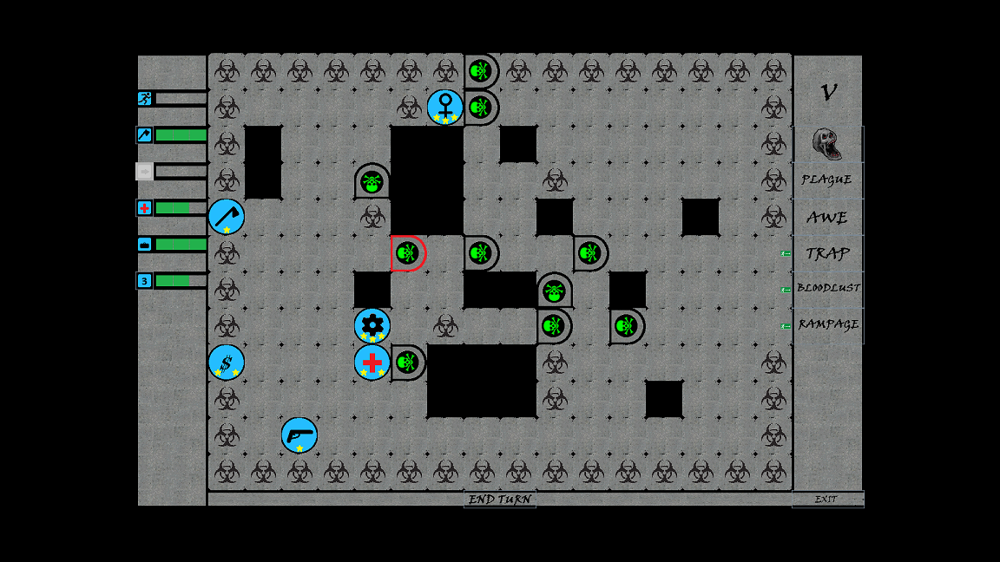

# Zombie Terror

Java Swing implementation of board game Zombie Terror.
Turn-based game for two players.

## Game rules

Game rules can be found there: 
[https://boardgamegeek.com/boardgame/167238/zombie-terror](https://boardgamegeek.com/boardgame/167238/zombie-terror)

## Setup

Code should be easily opended by any IDE for example Eclipse or Netbeans.

To start the game just run jar file

## Release History

* 1.0.0
    * Final woring build
* 1.0.1
    * Resource related bugfix	

